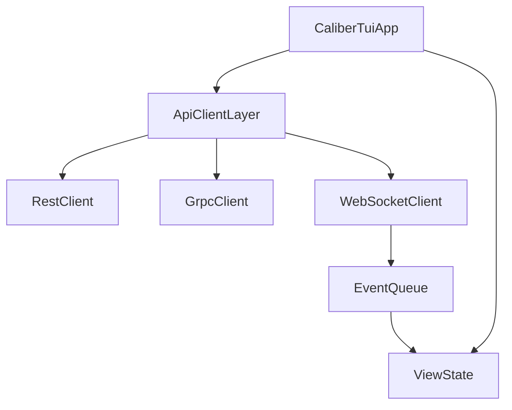

# Plan: API Tests + Full TUI Implementation

## Current State

- `caliber-tui` crate does not exist yet.
- `caliber-api` property tests present, but missing broadcast, gRPC parity, and DSL round-trip tests.
- Specs for TUI are in `.kiro/specs/caliber-tui/` and must be followed end-to-end.

## Scope

1) Finish missing `caliber-api` property tests.

2) Implement full `caliber-tui` crate (core infrastructure, widgets, views, realtime updates, and property tests) in one pass, then wire into the workspace.

## Key Files

- API tests: [`c:\Users\eayou\.projects\.caliber\caliber-api\tests\`](c:\Users\eayou\.projects\.caliber\caliber-api\tests\)
- API internals: [`c:\Users\eayou\.projects\.caliber\caliber-api\src\`](c:\Users\eayou\.projects\.caliber\caliber-api\src\)
- TUI specs: [`c:\Users\eayou\.projects\.caliber\.kiro\specs\caliber-tui\design.md`](c:\Users\eayou\.projects\.caliber\.kiro\specs\caliber-tui\design.md), [`c:\Users\eayou\.projects\.caliber\.kiro\specs\caliber-tui\requirements.md`](c:\Users\eayou\.projects\.caliber\.kiro\specs\caliber-tui\requirements.md), [`c:\Users\eayou\.projects\.caliber\.kiro\specs\caliber-tui\tasks.md`](c:\Users\eayou\.projects\.caliber\.kiro\specs\caliber-tui\tasks.md)
- Shared types: [`c:\Users\eayou\.projects\.caliber\docs\DEPENDENCY_GRAPH.md`](c:\Users\eayou\.projects\.caliber\docs\DEPENDENCY_GRAPH.md)
- Type sources of truth: [`c:\Users\eayou\.projects\.caliber\caliber-core\src\lib.rs`](c:\Users\eayou\.projects\.caliber\caliber-core\src\lib.rs), [`c:\Users\eayou\.projects\.caliber\caliber-agents\src\lib.rs`](c:\Users\eayou\.projects\.caliber\caliber-agents\src\lib.rs), [`c:\Users\eayou\.projects\.caliber\caliber-api\src\types.rs`](c:\Users\eayou\.projects\.caliber\caliber-api\src\types.rs), [`c:\Users\eayou\.projects\.caliber\caliber-api\src\events.rs`](c:\Users\eayou\.projects\.caliber\caliber-api\src\events.rs), [`c:\Users\eayou\.projects\.caliber\caliber-api\proto\caliber.proto`](c:\Users\eayou\.projects\.caliber\caliber-api\proto\caliber.proto)

## Implementation Outline

### 0) Type Alignment Preflight (SOT First)

- Use codebase as source of truth; specs guide behavior; dependency graph is a north star for conflicts.
- Validate enum/struct alignment across core, agents, API types, WS events, and proto schema.
- Record any deltas and update `docs/DEPENDENCY_GRAPH.md` after conflicts are resolved.
- Call out WS-specific shapes that differ from core types (e.g., `AgentStatusChanged` uses `String`).

### 1) Complete `caliber-api` Property Tests

- Add tests for mutation broadcast, REST↔gRPC parity, and DSL round-trip under `caliber-api/tests/`.
- Reuse existing test helpers and generators where possible (including `caliber-test-utils` if already integrated).
- Validate WebSocket event emission by using the existing broadcast channel in [`caliber-api/src/ws.rs`](c:\Users\eayou\.projects\.caliber\caliber-api\src\ws.rs) and [`caliber-api/src/events.rs`](c:\Users\eayou\.projects\.caliber\caliber-api\src\events.rs).
- Validate gRPC parity by comparing route behavior in [`caliber-api/src/grpc.rs`](c:\Users\eayou\.projects\.caliber\caliber-api\src\grpc.rs) with REST handlers in [`caliber-api/src/routes/`](c:\Users\eayou\.projects\.caliber\caliber-api\src\routes\).
- Validate DSL round-trip via [`caliber-api/src/routes/dsl.rs`](c:\Users\eayou\.projects\.caliber\caliber-api\src\routes\dsl.rs).

### 2) Create `caliber-tui` Crate and Wire into Workspace

- Add `caliber-tui/` with complete `Cargo.toml` (no stubs), and update workspace `Cargo.toml` to include it.
- Keep dependency versions centralized in root `Cargo.toml` and use `workspace = true` in the crate.
- Define explicit `TuiConfig` (no defaults) to hold operational values (endpoints, backoff, refresh cadence, persistence path, theme selection).
- Implement core modules per spec: `main.rs`, `theme.rs`, `api_client.rs`, `state.rs`, `nav.rs`, `keys.rs`, `events.rs`, `notifications.rs`, plus a `config.rs` for `TuiConfig`.

### 3) Implement Reusable Widgets

- Add all widgets under `caliber-tui/src/widgets/` (tree, detail panel, filter bar, progress bar, status indicator, syntax highlighter).

### 4) Implement All Views

- Add all views under `caliber-tui/src/views/` (tenant, trajectory, scope, artifact, note, turn, agent, lock, message, dsl, config), and wire view switching.

### 5) Real-Time Update Infrastructure

- Implement WebSocket connection manager, event processor, and pause/resume queue behavior.

### 6) TUI Property Tests

- Add property tests for keybindings, status colors, token utilization, hierarchy rendering, filters, detail panel completeness, DSL syntax highlighting, WebSocket reconnection, and error display.

## Architecture Sketch (TUI Runtime)

## Non-Goals

- No cargo builds or tests will be run by the agent (per project rules).

## Implementation Todos

- api-broadcast-tests: Add mutation broadcast property tests in `caliber-api/tests`.
- api-grpc-parity-tests: Add REST↔gRPC parity property tests in `caliber-api/tests`.
- api-dsl-roundtrip-tests: Add DSL round-trip property tests in `caliber-api/tests`.
- type-alignment-preflight: Audit type alignment across core/agents/api/events/proto.
- tui-crate-setup: Create `caliber-tui` crate and add to workspace.
- workspace-deps-hygiene: Add `caliber-tui` deps via workspace dependencies (no drift).
- tui-config-design: Define explicit `TuiConfig` and loading (no defaults).
- tui-core-infra: Implement core TUI modules (main/theme/state/nav/keys/events/notifications/api_client).
- tui-widgets: Implement reusable widgets in `caliber-tui/src/widgets/`.
- tui-views: Implement all TUI views and wire navigation.
- tui-realtime: Implement WebSocket connection manager and event processing.
- tui-tests: Add property-based tests for TUI requirements.